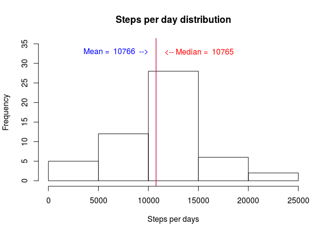
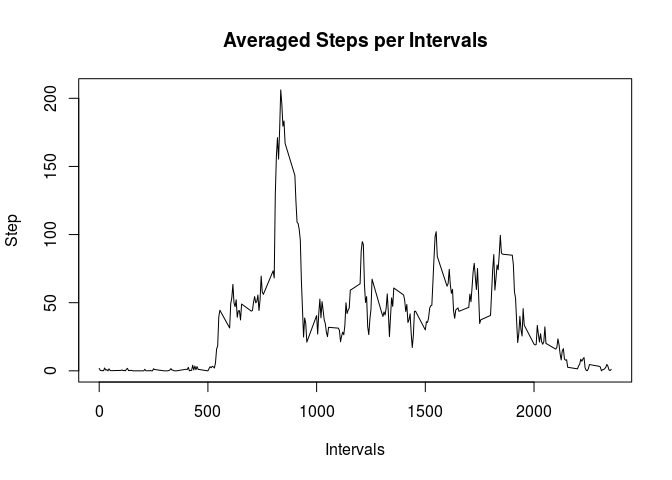
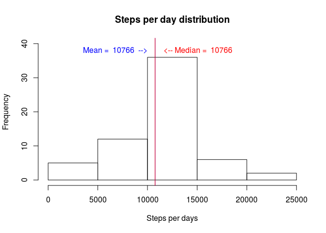
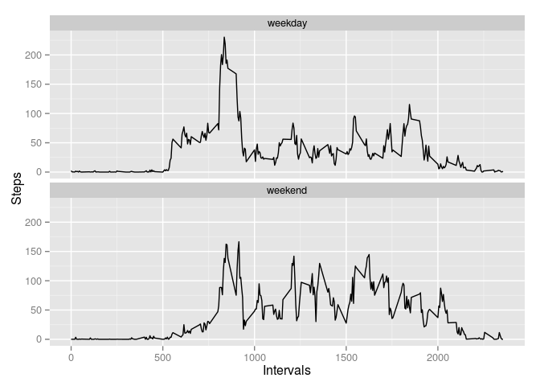

# Reproducible Research: Peer Assessment 1


## Loading and preprocessing the data

Loading the data:


```r
activity <- read.csv("activity.csv")
```

## What is mean total number of steps taken per day?

* Total number of steps taken per day


```r
steps_per_day<-sapply(split(activity$steps, activity$date), sum)
steps_per_day<-steps_per_day[complete.cases(steps_per_day)]
```

* Histogram of the total number of steps taken each day


```r
hist(steps_per_day, ylim=c(0,40), xlab =  "Steps per days",  main = "Steps per day distribution")
text(mean(steps_per_day)-5000,35,paste("Mean = ",round(mean(steps_per_day),0)), col="blue" )
text(median(steps_per_day)+5500,35,paste("Median = ",round(mean(steps_per_day),0)), col="red" )
abline(v=mean(steps_per_day))
abline(v=median(sort(steps_per_day)))
```

 

* Mean and median of the total number of steps taken per day


```r
mean(steps_per_day)
```

```
## [1] 10766.19
```

```r
median(sort(steps_per_day))
```

```
## [1] 10765
```

## What is the average daily activity pattern?

Time series plot (i.e. type = "l") of the 5-minute interval (x-axis) and the average number of steps taken, averaged across all days (y-axis)


```r
steps_interval_means<-sapply(split(activity$steps, activity$interval), mean, na.rm = T)
plot(unique(activity$interval), steps_interval_means, type="l")
```

 

Which 5-minute interval, on average across all the days in the dataset, contains the maximum number of steps?

The maximun number of steps on average is


```r
 max(x)
```

```
## [1] 206.1698
```

for the interval:


```r
 names(x[x==max(x)])
```

```
## [1] "835"
```

## Imputing missing values

The total number of missing values in the dataset:


```r
sum(!complete.cases(activity))
```

```
## [1] 2304
```

Filling missing values:


```r
activity1<-activity
missing_values <- !complete.cases(activity1)
activity_na <-activity1[missing_values,]
for(i in activity_na$interval){  
 activity_na[activity_na$interval==i,]$steps=steps_interval_means[as.character(i)]  
}

activity1[missing_values,]$steps = round(activity_na$steps,2)
```
* Total number of steps taken per day


```r
steps_per_day1<-sapply(split(activity1$steps, activity$date), sum)
##steps_per_day<-steps_per_day[complete.cases(steps_per_day)]
```

* Histogram of the total number of steps taken each day


```r
hist(steps_per_day1, ylim=c(0,40), xlab =  "Steps per days",  main = "Steps per day distribution")
text(mean(steps_per_day1)-5000,35,paste("Mean = ",round(mean(steps_per_day1),0)), col="blue" )
text(median(steps_per_day1)+5500,35,paste("Median = ",round(mean(steps_per_day1),0)), col="red" )
abline(v=mean(steps_per_day1))
abline(v=median(sort(steps_per_day1)))
```

 

* Mean and median of the total number of steps taken per day with filled missing values:


```r
mean(steps_per_day1)
```

```
## [1] 10766.18
```

```r
median(sort(steps_per_day1))
```

```
## [1] 10766.13
```
## Are there differences in activity patterns between weekdays and weekends?


```r
wd<-c("Monday"="weekday","Tuesday"="weekday","Wednesday"="weekday",
      "Thursday"="weekday","Friday"="weekday", "Saturday"="weekend" ,"Sunday"="weekend")

days <- weekdays(  as.Date(activity1$date))

activity1$day_type=factor(wd[days])

library(ggplot2)

steps_means <- aggregate(activity1$steps, by=list(interval=activity1$interval, day_type=wd[days]), mean)

qplot( interval/60, x, xlab="Intervals", ylab="Steps", data=steps_means,colours=c("blue", "red"),  geom="line")+ facet_wrap(~day_type, ncol = 1)
```

 


